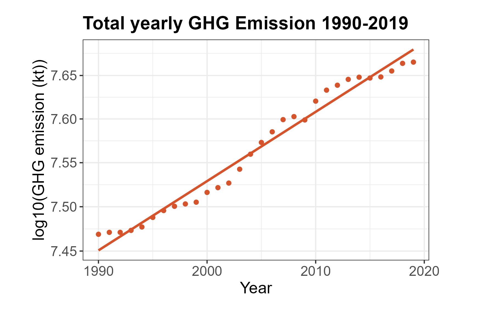
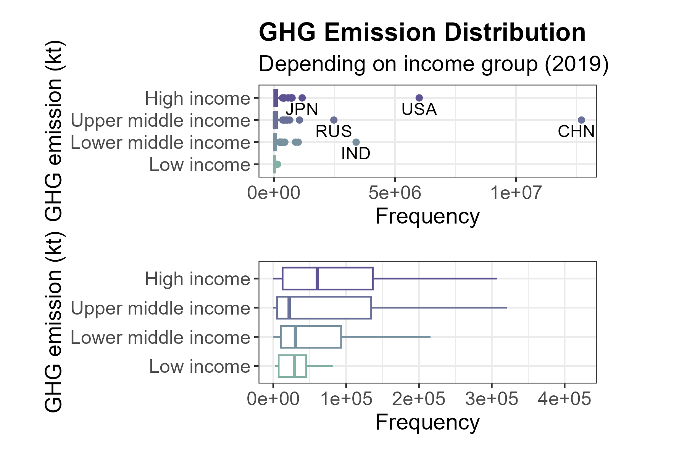

```{r setup, include=FALSE}
# devtools::install_github(repo="haozhu233/kableExtra", ref="a6af5c0")
knitr::opts_chunk$set(echo = TRUE)
library(kableExtra)
```

## Introduction
Human activities are driving up the earth’s temperature. This rise in temperature has long-term, negative effects on the climate. Increased frequency and intensity of extreme weather events such as flooding, droughts, wildfires, and hurricanes are some of these effects that influence millions of people and generate trillions in economic losses (UN, 2022).

The main cause of climate change is a phenomenon known as the greenhouse effect. Human activity is resulting in the increased emission of so-called greenhouse gases (GHGs), such as water vapor, carbon dioxide, methane, nitrous oxide, and fluorinated gases. These gases get trapped in the atmosphere and let the light from the sun in but keep some of the heat from escaping, like the glass walls of a greenhouse. The more GHGs in the atmosphere, the more heat gets trapped, strengthening the greenhouse effect, and increasing the earth’s temperature (UN,	2022).

However, not all human activities emit the same amount of GHGs into the atmosphere. Depending on income and lifestyle choices individuals have access to different types and amounts of resources. Although the inequality in average income between countries has decreased during the past 25 years, the income gap between countries is still ample. According to the UN (2023a), the average income of people living in North America is 16 times higher than that of people in sub-Saharan Africa. The objective of this report is to explore the relationship between a country’s average income group and its emission of GHGs.

The report aims to investigate the following research questions:

- *Q1.* Has the total greenhouse gas emissions globally per year increased from 1990 to 2019?
- *Q2.* Was there a difference in greenhouse gas emissions between low-income and high-income countries in 2019?
- *Q3.* Was there a difference in greenhouse gas emissions between the income groups low, lower middle, upper middle, and high income in 2019?
- *Q4.* Are there any significant associations between a country’s fulfillment of the 2019 carbon budget per person and year and their assigned income group?

To make it easier for the reader to follow, the research questions have been divided into four parts, *Part 1: Global greenhouse gas emission trend 1990-2019*, *Part 2: Difference in greenhouse gas emission low vs high-income countries*, *Part 3: Difference in greenhouse gas emission between four income groups*, and *Part 4: Associations between income group and carbon budget fulfillment*. Part 1 aims at answering the first research question (*Q1*), Part 2 at answering the second research question (*Q2*), Part 3 at answering the third research question (*Q3*), and Part 4 to answering the fourth research question (*Q4*).


## Method
This section will provide a brief explanation of methods and a description of the workflow. All statistical analyses have been performed in R. The following packages were used (what they were used for in parenthesis):

- tidyverse	(data	sorting,	plots,	etc.)
- Rcmdr	(numSummary)
- corrplot	(correlation	plot)
- kableExtra (tables)
- cowplot (plot grid)

### Data collection
Two public datasets have been used in this report, both have been downloaded from the World Bank’s database. 

The main dataset that was downloaded was the “Total greenhouse gas emissions (kt of CO2 equivalent)”, which was last updated on 2022-09-16 (World Bank, 2023a). This data have been used to answer all four research questions. The data was downloaded as an excel file containing three sheets. The main sheet contains the	 columns “Country Name”, “Country Code”, “Indicator Name”, “Indicator Code”, and the greenhouse gas emissions for each country and economy from 1960 to 2019 sorted into columns based on year, i.e. a wide format. The two other sheets contain metadata regarding countries, e.g. region and income group, and indicators.

The other dataset that was downloaded was the “Population, total”, which was last updated on 2022-12-22 (World bank, 2023b). This data was used in combination with the above mentioned dataset to answer research question 4. This data was also downloaded as an excel file and also contained three sheets. The main data sheet contains the columns “Country Name”, “Country Code”, “Indicator Name”, “Indicator Code”, as well as population data for all countries and economies between the years 1960 to 2021. The two other sheets contain metadata regarding countries and indicators.

### Data preparation and cleaning
The data was prepared in two different stages, first in Excel and then in R. For both imported workbooks, the main data sheet was transformed and then saved as a CSV file. These CSV files were then imported into R where the transformation and cleaning of the data continued.

First, the Excel workbook containing data for the total greenhouse gas emissions was prepared and cleaned. Table \@ref(tab:ghg) shows changes made to the sheet containing the main data.

```{r echo=FALSE, message=FALSE, warning=FALSE}
source("code/ghg_changes_tbl.R")
```

```{r ghg, echo=FALSE, message=FALSE, warning=FALSE}
kbl(ghg_changes_df, align = "l",
    caption = "Changes made to greenhouse gas emission data in both Excel and R. \\label{ghg}") %>%
  kable_paper(full_width = F) %>%
  column_spec(1, bold = T) %>%
  collapse_rows(columns = 1:2, valign = "top") %>%
  footnote(symbol = "Compared to the World Bank’s list of countries (World bank, 2023c). For full list see appendix A1.")
```

Note that Venezuela (VEN) did not have a value for income group in the metadata sheet, “Venezuela, previously classified as an upper-middle income country, is now unclassified due to a lack of available data in the recent period” (World Bank, 2022).

Secondly, the Excel workbook containing data for the populations was prepared and cleaned. Table \@ref(tab:pop) shows changes made to the sheet containing the main data.

```{r echo=FALSE, message=FALSE, warning=FALSE}
source("code/pop_changes_tbl.R")
```

```{r pop, echo=FALSE, message=FALSE, warning=FALSE}
kbl(ghg_changes_df, align = "l",
    caption = "Changes made to population data in both Excel and R. \\label{pop}") %>%
  kable_paper(full_width = F) %>%
  column_spec(1, bold = T) %>%
  collapse_rows(columns = 1:2, valign = "top") %>%
  footnote(symbol = "Compared to the World Bank’s list of countries (World bank, 2023c). For full list see appendix A1.") 
```


The carbon budget per capita and year until 2050 was estimated using the remaining carbon budget of 500 GtCO2 which is in line with keeping global warming to 1.5°C (50% probability) according to IPCC A6 WG1 (IPCC, 2021). However, as the budget was for 2020, the total greenhouse gas emission from 2019 was added to this budget. The calculated carbon budget for 2019 was then divided with the average population and 
the remaining years until 2050, see Equation \@ref(eq:budget).

\begin{equation}
carbon\_budget_{per\_capita\_and\_year\_until\_2050} = \frac{carbon\_budget\_2019}{pop\_avg \cdot years \_left} (\#eq:budget)
\end{equation}

The year 2050 was chosen as it is the year UNDP mentions in their emission goal to reach global net zero emission of CO2. Which is related to the thirteenth sustainable development goal: Climate action (UNDP, 2023). UN projects the population in 2050 will be 9.8 billion people (UN, 2023b).

Lastly, additional filtering was done to custom the data to be able to answer each specific research question. This was done in R and will not be covered in this chapter. For the continued cleaning process it is recommended to read the appendix for the respective report part.

### Statistical methods and tests
This sub-section will explain the workflow related to the statistical tests used in this report.

#### Linear regression
The first research question the report aims to answer was Q1. Has the total greenhouse gas emissions globally increased from 1990 to 2019? As time cannot be affected by greenhouse gas emissions but greenhouse gas emissions can be affected by time, a linear regression model was used to find the answer to this question. Time was chosen as the explanatory variable and total greenhouse gas emission as the response variable, i.e. greenhouse gas emission (ghg_emission) was set as a function of time (year), $ghg\_emission = b_{0} + b_{1} \cdot year$.

To see if the model was well adapted to the dataset, a scatterplot as well as diagnostic tools were made to examine if the relationship looked linear. When analyzing the basic diagnostic plots the following were considered:

- Residuals vs Fitted: A good fit has equally spread residuals around a horizontal line without distinct patterns. Indicates equal variance.
- Normal Q-Q: In a good fit the residuals follow the straight dashed line. Indicates a normal	distribution.
- Scale-Location: This figure shows the same as Residuals vs Fitted, but on a different scale.
- Residuals vs Leverage: Good fit when all data points are inside Cook’s distance. Indicates that no influential outliers exist.

If the model did not seem to be a good fit, the response variable was transformed using first a logarithmic transformation and thereafter a square root transformation. To be able to decide what model was the best fit for the data the results from the diagnostic tools as well as the R2 values from the models were compared.

#### T-test
The	 first step in answering the second research question *Q2. Was there a difference in greenhouse gas emissions between low-income and high-income countries in 2019?* was to check if the data were normally distributed. This was done by plotting histograms for both groups (high-income and low-income countries). If the data was normally distributed, a t-test would be performed. If it was not, Wilcoxon’s rank-sum test would be used. The latter analyzes the median differences, therefore it can be used on non-normally distributed (skewed)	data.

#### One-way ANOVA
To answer the third research question, *Q3*, if there was a difference in greenhouse gas emissions between the four income groups low, lower middle, upper middle, and high income in 2019 it was first investigated whether a One-Way Analysis of Variance (one-way ANOVA) could be used.

To be able to perform an ANOVA test two assumptions regarding the data had to be met.

1. The variance across groups was homogeneous
2. The data was normally distributed

To check if the data matched the assumptions, basic diagnostic plots of residuals vs fitted and normal Q-Q were plotted.

The Residuals vs Fitted plot showed the spread of the residuals around a horizontal line for each group. To comply with the assumption of homogeneous variance across groups the spread of residuals for the group with the largest variance had to be less than three times the spread of the group with the smallest. If not, the data in the ANOVA model was considered heteroscedastic which meant the variance of the residuals was unequal over the range of measured values, i.e. the first assumption was not met.

For the data in the ANOVA model to comply with the second assumption of normal distribution, the Normal Q-Q plot would show the residuals following the straight dashed line	in the graph. If the residuals deviated too much from the straight line the distribution of the data was considered non-normal.

If the data did not comply with one or both of the assumptions, the response variable (GHG emission) was transformed. Two transformations were tested, the logarithmic transformation (Equation \@ref(eq:log)) and the square root transformation (Equation \@ref(eq:root)).

\begin{equation}
data\_log\_transformed = \log_{10}\left(ghg\_emisson\right) (\#eq:log)
\end{equation}

\begin{equation}
data\_sqrt\_transformed = \sqrt{ghg\_emisson} (\#eq:root)
\end{equation}

If the data did not meet the ANOVA assumptions using either of mentioned transformations, the Kruskal-Wallis rank sum test for non-parametric data was used instead. If the test showed that there was a difference between at least two of the groups, a post-hoc test (using the	PMCMRplus	package) would be performed to be able to decide between which groups the difference lay.

#### Chi-square test
A	 chi-square ($\chi^2$) test can be applied to statistical information of the type frequencies (integers) that are classified into different categories, usually a contingency table. The analysis investigates if the observed counts differ significantly from the expected counts. A chi-square test can be applied to different types of research questions. In this study, a	chi square test for association was used to answer research question 4, *Q4. Are there any significant associations between a country’s fulfillment of the 2019 carbon budget per person and year and their assigned income group?*

The chi-square test is a nonparametric test. However, all the expected frequencies should be equal to or larger than 5. If that is not the case it is recommended to perform a Fisher’s exact test instead. Hence, the values of the expected counts were inspected before moving forward with the analysis.

To investigate what attribute contributed most to the results of the chi-square test the individual chi-square components i.e. the residuals of the test were analyzed. Analyzing the residuals of the chi-square test gives an indication of which attributes contributed most to the chi-square result but not in what direction. Therefore, the direction of the deviation was found by analyzing the deviation of the observed frequency compared to the expected frequency for each attribute.


## Result
This section will present the results of the analysis.

### Part 1: Global green house gas emission trend 1990-2019
Simple linear regression was used to test if the total GHG emissions increased from 1990 to 2019, i.e. to test if the year significantly predicted the total greenhouse gas emissions. The fitted regression model was: $log_{10}(GHG \; emission) = 0.0079(year) − 8.3$. A visualization of the regression model can be seen in Figure 1.


Figure 1. Scatterplot showing the linear regression model : $log_{10}(GHG \; emission) = 0.0079(year) − 8.3$.

The overall regression was statistically significant (R2 = .97, F(28, 1) = 1122, p < .001). It was found that the year significantly predicted the total emission of GHGs ($\beta$ = 0.0079, p = < .001). I.e. total greenhouse gas emissions significantly increased from 1990 to 2019.


### Part 2: Difference in green house gas emission low vs high income countries
As seen in Figure 2, the data was found to be skewed to the right. Hence, a Wilcoxon rank-sum test was used to analyze if there was a difference in greenhouse gas emissions between high-income and low-income countries in 2019.


Figure 2. Histograms showing the right-skewed distribution of GHG emission for high-income and low-income countries.

The median greenhouse gas emission in the high-income group was 60 590kt, whereas the median greenhouse gas emission in the low-income group was 29 110kt. There was a statistically significant difference between the groups in terms of median greenhouse gas emission in 2019 (W=1040, p = .024, $\eta_{high}$=57, $\eta_{low}$=28, Wilcoxon’s rank-sum test). Based on the medians, high-income countries released more than twice, 31 480kt, more greenhouse gases than low-income countries.

The average greenhouse gas emission from high-income countries was 261 137kt (SD 812
009), and the average emission from low-income countries was 36 169kt (SD 34 519). The large difference between the mean and the median, especially for high-income countries, confirms the observation made from the histogram (Figure 2) that the data was skewed. In this case, it means that there are a few countries in the high-income group that releases much more greenhouse gases than the other countries in the same group.

The box plots below (Figure 3) illustrate the difference in median greenhouse gas emissions between high- and low-income countries in 2019. Also here it is possible to see that there are a few countries that release way more than the rest of the high-income countries by observing the outliers. The USA released the most greenhouse gases out of the high-income countries in 2019, 6 001 210kt. That is more than five times the amount released by Japan, which had the second largest greenhouse gas emission of 1 166 510kt.


Figure 3. Boxplots showing the differences in GHG emission between high-income and low-income countries, both with and without extreme cases (outliers).

Another observation worth mentioning is that the high-income sample contained 57
countries, and the low-income sample contained 28 countries. That the low-income sample was around half the sample size of high-income countries may have affected the results of this analysis.


### Part 3: Difference in greenhouse gas emission between four income groups
Statistically significant differences in greenhouse gas emissions during 2019 were not observed between countries in the four income groups, high income (Mdn=60590), upper middle income (Mdn=21915), lower middle income (Mdn=30530), and low income
(Mdn=29110) as visualized in Figure 4 below.


Figure 4. GHG emission per income group for the four income groups high, upper middle, lower middle, and low income. The median GHG emission of high income countries was 60590ktCO2, upper middle income countries was 21915ktCO2, lower middle income countries was 30530ktCO2, and low income countries was 29110ktCO2.

A Kruskal-Wallis rank sum test returned a p-value of 0.18 ($\chi^2$(3)=4.891). Since the p-value was larger than the critical value ($\alpha$=0.05), the null hypothesis of equal population means was not rejected and it was concluded that there is not a (statistically) significant difference among the population means, i.e. there was not a difference in GHG emission between at the income groups.


### Part 4: Associations between income group and carbon budget fullfillment
The remaining carbon budget in line with keeping global warming to 1.5°C was 500 GtCO2 (50% probability) for 2020 and forward (IPCC, 2021). During 2019, approximately 46 GtCO2 equivalents of total greenhouse gases were released globally. Adding that to the carbon budget for 2020 gives a carbon budget of around 546 Gt for 2019. UN projects the world population to reach 9.8 billion in 2050 (UN, 2017). The world population year 2019 was estimated to be approximately 7.7 billion people. Given an average population of ~ 8.7 billion people between 2019 and 2050, that results in a carbon budget per person for 2019 of 0.002kt or 2t CO2/person/year until 2050.
The fulfillment of the 2019 carbon budget per capita and year until 2050 based on income group was noted in the contingency table below (Table \@ref(tab:ct)).

```{r echo=FALSE, message=FALSE, warning=FALSE}
source("code/part4_associations.R")
```

```{r ct, echo=FALSE, message=FALSE, warning=FALSE}
ghg_ct %>%
  kbl(caption = "Contingency table showing how many countries in each income group emitted over vs under the 2019 carbon budget per person and year until 2015. \\label{ct}") %>%
  kable_styling(full_width = FALSE) %>%
  column_spec(1, bold = T) %>%
  add_header_above(c(" " = 1, "Budget comparison" = 2))
```


The contingency table in Table \@ref(tab:ct) is illustrated in Figure 5.


Figure 5. Bar plot visualizing how many countries in each income group emitted over vs under the 2019 carbon budget per person and year until 2015.

A chi-square test for association indicated there was a significant association between income group and carbon budget fulfillment ((χ2)=76.97, df=3, p<.001, χ2-test for association). For further nuance of the results, the individual chi-square components were analyzed, see Table \@ref(tab:comp).

```{r echo=FALSE, message=FALSE, warning=FALSE}
source("code/part4_associations.R")
```

```{r comp, echo=FALSE, message=FALSE, warning=FALSE}
chisq_comp %>%
  kbl(caption = "Individual chi-square components from the chi-square test. \\label{comp}") %>%
  kable_styling(full_width = FALSE) %>%
  column_spec(1, bold = T) %>%
  add_header_above(c(" " = 1, "Budget comparison" = 2))
```

The largest individual chi-square value was for Low income and Under (29.14) which was contributing approximately 38% of the total chi-square value of 76.97, i.e. this association has had a large effect on the total result. The second largest individual chi-square value was for *High income and Under* (12.00), followed by *Upper middle
income and Under* (10.95), *Lower middle income and Under* (10.95), *Low income and Over* (7.77), *High income and Over* (3.20), *Upper middle income and Over* (2.92),
and *Lower middle income and Over* (2.32).

Figure 6 shows the contribution to the total chi-square result in percent for each association based on their individual chi-square component. The bigger and darker the filled circle is, the larger the contribution of that particular association to the total chi-square value.


Figure 6. Contribution to the total chi-square result in percent for each association based on their individual chi-square component.

Figure 6 illustrates the largest contribution of the association of low income-under (~38%) to the total chi-square result. It also shows the smaller contributions of *high income-under* (~16%), *upper middle income-under* (~14%), *lower middle income-under* (~11%), *low income-over* (~10%), *high income-over* (~4%), *upper middle income-over* (~4%), and *lower middle income-over* (~3%).

Analyzing the residuals of the chi-square test gave an indication of which attributes
contributed most to the chi-square result, i.e. which observed frequency of attributes deviated most from the expected frequency of the respective attribute. The direction of the deviation can be observed in Table \@ref(tab:expdiff) below. A minus sign indicates that the observed frequency was less than the expected frequency for that association.

```{r echo=FALSE, message=FALSE, warning=FALSE}
source("code/part4_associations.R")
```

```{r expdiff, echo=FALSE, message=FALSE, warning=FALSE}
chisq_exp_diff %>%
  kbl(caption = "Expected frequency of countries fulfilling the 2019 carbon budget per capita and year until 2050. The deviation of the observed frequency compared to the expected frequency in parenthesis. \\label{expdiff}") %>%
  kable_styling(full_width = FALSE) %>%
  column_spec(1, bold = T) %>%
  column_spec(4:5, background = "#f2f2f2") %>%
  add_header_above(c(" " = 1, "Expected frequency" = 2, "Difference"=2)) %>%
  add_header_above(c(" " = 1, "Budget comparison" = 4)) 
```

There had been 19 observations on low income countries under the carbon budget per capita and year. As seen in Table \@ref(tab:expdiff), if only chance would have affected their choice the expected frequency would have been around 6, i.e the large individual chi square value of 29.14 should be interpreted as low income countries emitted under the carbon budget per capita and year much more than expected.

The same reasoning, but opposite, goes for high income countries under the carbon budget per capita and year. 0 observations were made compared to around 12 expected, i.e. the individual chi square value of 12.00 should be interpreted as high income countries emitted under the carbon budget per capita and year less than expected.

Upper middle income countries emitted under the carbon budget less than expected (obs. 3, exp. ~11) whereas lower middle income countries emitted under the carbon budget more than expected (obs. 21, exp. ~11). Low income countries emitted over the carbon budget less than expected (obs. 9, exp. ~22), so did lower middle income countries (obs. 32, exp. ~42). High income countries (obs. 57, exp. ~45) and upper middle income countries (obs. 52, exp. ~41) both emitted over the carbon budget more than expected.

## Discussion
This section will discuss the methodology, the findings, and draw conclusions.

### Choice of Data
This report focuses on total GHG emissions per country. If instead GHG emission per capita for each country would have been chosen the results may have had another outcome. Also, the chosen data does not consider within-country inequalities in income. It is possible that there are huge emitters in low-income countries and low emitters in high-income countries.

Additionally, it is not known how the total GHG emission is calculated, and which country the emission is recorded in when it comes to offshore consumption (export), same goes for tourism and other activities performed by individuals living in another country from where the emission is being produced.

### Result
The Wilcoxon rank-sum test in part 2 of this report and the Kruskal-Wallis rank sum test in part 3 gave different results. Considering the same data for low-income and high-income countries was used, either the Wilcoxon rank-sum test should have indicated that there was no significant difference between the income groups. Or, the Kruskal-Wallis rank sum test should have shown that there was a significant difference between at least two groups, and post-hoc would have shown that there was a difference between high-income and low-income countries in terms of GHG emissions. However, observing the boxplots of the two parts, Figure 3 (boxplot for part 2) shows it is likely to be a difference as the median line of the high-income box lies outside of the low-income box entirely. The same goes for the boxes in Figure 4 (boxplot for part 3).

Hence, the opposing test results might be due to how the different tests work. Although they are both non-parametric tests, maybe the Wilcoxon rank-sum test is less sensitive than the Kruskal-Wallis rank sum test. It is also possible that the difference between the tests might be because the data was transformed in part 3, but not in part 2. Regardless, this is a topic for further research.

### Conclusion
*Q1. Has the total greenhouse gas emissions globally per year increased from 1990 to 2019?*

Yes. Based on the sample, the total GHG emissions globally per year increased from 1990 to 2019. It was found that the year significantly predicted the total emission of GHGs ($\beta$ = 0.0079, p = < .001), using the regression model $log_{10}(GHG \; emission) = 0.0079(year) − 8.3$. The regression was statistically significant (R2 = .97, F(28, 1) = 1122, p < .001).

*Q2. Was there a difference in greenhouse gas emissions between low-income and high-income countries in 2019?*

Yes. There was a significant difference between the groups in terms of median greenhouse gas emission in 2019 (W=1040, p = .024, $\eta_{high}$=57, $\eta_{low}$=28 Wilcoxon’s rank-sum test). The median greenhouse gas emission in the high-income group was 60 590kt, whereas the median greenhouse gas emission in the low-income group was 29 110kt. Based on the medians, high-income countries released more than twice, 31 480kt, more greenhouse gases than low-income countries.

*Q3. Was there a difference in greenhouse gas emissions between the income groups low, lower middle, upper middle, and high income in 2019?*

No. Significant differences in greenhouse gas emissions during 2019 were not observed
between countries in the four income groups, high income (Mdn=60590), upper middle
income (Mdn=21915), lower middle income (Mdn=30530), and low income (Mdn=29110)
($\chi^2$(3)=4.891, p=.18, Kruskal-Wallis rank sum test).

*Q4. Are there any significant associations between a country’s fulfillment of the 2019 carbon budget per person and year and their assigned income group?*

Yes. There was a significant association between income group and carbon budget fulfillment (($\chi^2$)=76.97, df=3, p<.001, $\chi^2$-test for association). Low income countries emitted under the carbon budget per capita and year until 2050 much more than expected (obs. 19, exp. ~6). High income countries emitted under the carbon budget less than expected (obs. 0, exp. 12). Upper middle income countries emitted under the carbon budget less than expected (obs. 3, exp. ~11) whereas lower middle income countries emitted under the carbon budget more than expected (obs. 21, exp. ~11). Low income countries emitted over the carbon budget less than expected (obs. 9, exp. ~22), so did lower middle income countries (obs. 32, exp. ~42). High income countries (obs. 57, exp. ~45) and upper middle income countries (obs. 52, exp. ~41) both emitted over the carbon budget more than expected.

## References
IPCC, 2021: Chapter 5. In: Climate Change 2021: The Physical Science Basis. Contribution of Working Group I to the Sixth Assessment Report of the Intergovernmental Panel on Climate Change [Canadell, J.G., P.M.S. Monteiro, M.H. Costa, L. Cotrim da Cunha, P.M. Cox, A.V. Eliseev, S. Henson, M. Ishii, S. Jaccard, C. Koven, A. Lohila, P.K. Patra, S. Piao, J. Rogelj, S. Syampungani, S. Zaehle, and K. Zickfeld, 2021: Global Carbon and other Biogeochemical Cycles and Feedbacks. In Climate Change 2021: The Physical Science Basis. Contribution of Working Group I to the Sixth Assessment Report of the Intergovernmental Panel on Climate Change [Masson-Delmotte, V., P. Zhai, A. Pirani, S.L. Connors, C. Péan, S. Berger, N. Caud, Y. Chen, L. Goldfarb, M.I. Gomis, M. Huang, K. Leitzell, E. Lonnoy, J.B.R. Matthews, T.K. Maycock, T. Waterfield, O. Yelekçi, R. Yu, and B. Zhou (eds.)]. Cambridge University Press, Cambridge, United Kingdom and New York, NY, USA, pp. 673–816, doi: 10.1017/9781009157896.007 .]

UN. (2022, January 8). 5 things you should know about the greenhouse gases warming the planet.
https://news.un.org/en/story/2022/01/1109322?gclid=CjwKCAiA2fmdBhBpEiwA4CcHzUwrR4jLTspL71lj2Ws5qFqjrJOTwmP0k7811SeHnzcMnlizJW-1XRoCRzQQAvD_BwE

UN. (2023a, January 9). Inequality – Bridging the Divide.
https://www.un.org/en/un75/inequality-bridging-divide

UN. (2023b, January 9). World population projected to reach 9.8 billion in 2050, and 11.2 billion in 2100. 
https://www.un.org/en/desa/world-population-projected-reach-98-billion-2050-and-112-billion-2100

UNDP. (2023, January 9). Goal 13 CLIMATE ACTION. https://www.undp.org/sustainable-development-goals?utm_source=EN&utm_medium=GSR&utm_content=US_UNDP_PaidSearch_Brand_English&utm_campaign=CENTRAL&c_src=CENTRAL&c_src2=GSR&gclid=Cj0KCQiAtvSdBhD0ARIsAPf8oNnNDkgZy-XOe1TfBZIdNeON7m6HYxyS2cTCc34xeR5SzGZYNxGm3MUaArtUEALw_wcB#climate-action

World Bank (2022, July 1). New World Bank country classifications by income level: 2021-2022. 
https://blogs.worldbank.org/opendata/new-world-bank-country-classifications-income-level-2021-2022

World Bank. (2023a, January 9). Total greenhouse gas emissions (kt of CO2 equivalent).
https://data.worldbank.org/indicator/EN.ATM.GHGT.KT.CE?view=chart

World Bank. (2023b, January 9). Population, total.
https://data.worldbank.org/indicator/SP.POP.TOTL?end=2019&start=2019&view=chart

World Bank. (2023c, January 9). Countries and Economies.
https://data.worldbank.org/country

## Appendix

### Data Preparation
This appendix contains a list of all economies, regions, etc., that was removed during the data preparation. 

The following economies were removed:

- Africa Eastern and Southern 
- Africa Western and Central 
- Arab World 
- Caribbean small states 
- Central Europe and the Baltics 
- Early-demographic dividend 
- East Asia & Pacific 
- East Asia & Pacific (excluding high income)
- East Asia & Pacific (IDA & IBRD countries)
- Euro area 
- Europe & Central Asia 
- Europe & Central Asia (excluding high income)
- Europe & Central Asia (IDA & IBRD countries)
- European Union 
- Fragile and conflict affected situations 
- Heavily indebted poor countries (HIPC) 
- High income 
- IBRD only 
- IDA & IBRD total 
- IDA blend 
- IDA only 
- IDA total 
- Late-demographic dividend 
- Latin America & Caribbean 
- Latin America & Caribbean (excluding high income)
- Latin America & the Caribbean (IDA & IBRD countries)
- Least developed countries: UN classification
- Low & middle income
- Low income
- Lower middle income
- Middle East & North Africa
- Middle East & North Africa (excluding high income)
- Middle East & North Africa (IDA & IBRD countries)
- Middle income
- North America
- Not classified
- OECD members
- Other small states
- Pacific island small states
- Post-demographic dividend
- Pre-demographic dividend
- Small states
- South Asia
- South Asia (IDA & IBRD)
- Sub-Saharan Africa
- Sub-Saharan Africa (excluding high income)
- Sub-Saharan Africa (IDA & IBRD countries)
- Upper middle income
- World